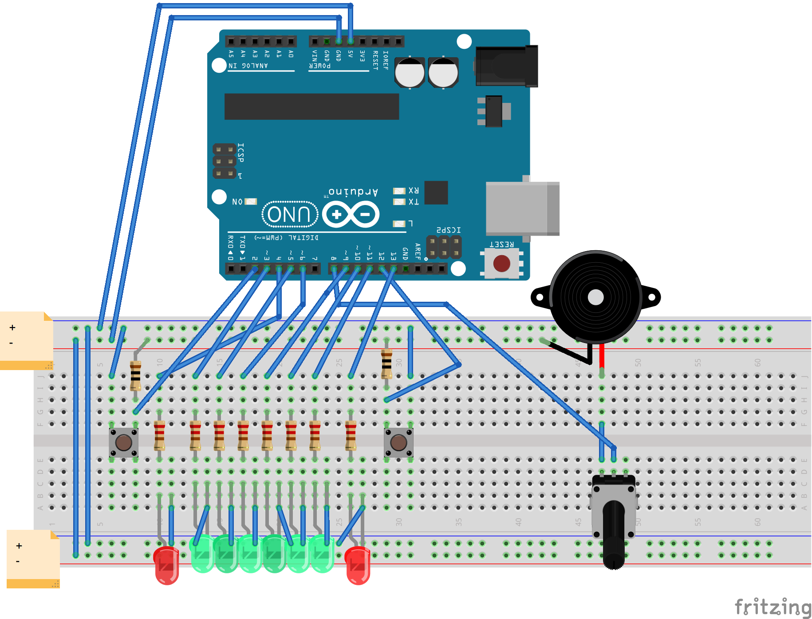

# tennis-2.3.0

Arduino Uno R3 "Tennis" game. Uses a number of classes, multiple files, for just a handful of LEDS, two switches, and a buzzer.

It's our first "serious" attempt at writing something for Arduino not from an existing Sketch, and really expanding our understanding of C++.

##Play:

* Play starts randomly from either player
* Once the "ball" reaches the end you have a varying amount of time (depending on speed) to "hit" it by pressing the button.
* The quicker you hit it the faster it goes, or hit it real slow for a "changeup"
* Everything is configurable from `Tennis.h`

##Breadboard:

I tried to make a Fritzing schematic but could never get the wires routed... if anyone has any suggestions...

##Video
Featuring "old man" reaction time ;) Click to open video on Youtube.

##Coming soon
Tennis v3 will abstract the inputs and outputs using Interface Classes, along with examples using shift registers, and an LCD.
